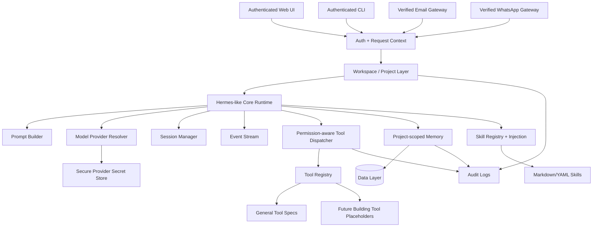

# Product Architecture

## Overview

BuildingAgent is a monorepo with a Python backend/agent runtime, a Next.js Web UI, a CLI, gateway adapters, project-scoped memory, tool and skill systems, and documentation for future building-domain extensions.

## Architecture Diagram

## Boundaries

- Entry points authenticate users but do not execute tools directly.
- Runtime receives a resolved request context.
- Tool dispatcher is the only path to tool execution.
- Permission checks are backend-side.
- Memory and data retrieval are project-scoped.
- Audit logs are emitted for sensitive tool, memory, and data access.

## M001 Architecture Output

M001 creates documentation and placeholders. It does not implement the runtime, Web UI, CLI, gateways, memory, tools, or skills.
