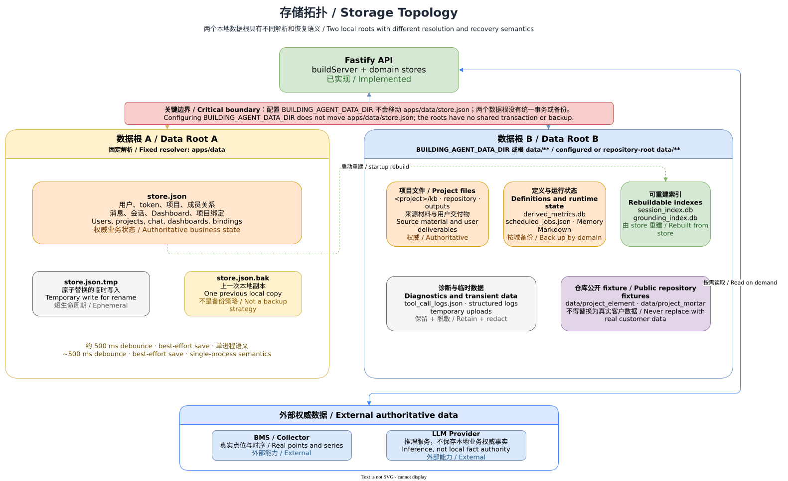

# Runtime and storage topology

[中文](../../zh-CN/architecture/runtime-storage.md) | [Developer documentation home](../README.md) | [Current implementation](current-architecture.md)

> Code baseline: `main@af44ff15`. Status: Implemented, but default local persistence is not a production database architecture.

## 1. Status and code baseline

The API currently resolves two independent data roots. They must not be conflated, and neither is a backup of the other.

| Data root | Default location | Resolver | Main content |
| --- | --- | --- | --- |
| SeedStore root | `apps/data/store.json` | [persistence.ts](../../../../apps/api/src/persistence.ts) | Users/tokens, projects/memberships, messages/conversations, Dashboards, and several project bindings. |
| Project data root | `data/**` | [knowledgeBase.ts](../../../../apps/api/src/agent/knowledgeBase.ts) | KB, Repository, Memory, outputs, logs, scheduler state, and SQLite data. |

`BUILDING_AGENT_DATA_DIR` (with `DATA_DIR` compatibility) overrides only the project data root; it does not change the SeedStore path in `persistence.ts`. Setting a data directory therefore does not migrate all local state.

## 2. Purpose and scope

This page classifies data into authoritative business state, user files, authoritative definitions/runtime records, rebuildable indexes, and cache/diagnostics. Classification follows recovery semantics rather than file extension. Production deployments need explicit backup, concurrent-write, and retention policies; current code supplies lightweight local persistence.

## 3. User and source entry points

- JSON load/debounced save: [apps/api/src/persistence.ts](../../../../apps/api/src/persistence.ts)
- SeedStore shape and local fixtures: [apps/api/src/seed.ts](../../../../apps/api/src/seed.ts)
- Data root, KB, and Repository: [apps/api/src/agent/knowledgeBase.ts](../../../../apps/api/src/agent/knowledgeBase.ts)
- Memory files: [apps/api/src/agent/curatedMemory.ts](../../../../apps/api/src/agent/curatedMemory.ts)
- Session index: [apps/api/src/sessionIndex.ts](../../../../apps/api/src/sessionIndex.ts)
- Grounding index: [apps/api/src/groundingRuleIndex.ts](../../../../apps/api/src/groundingRuleIndex.ts)
- Derived Metrics SQLite: [apps/api/src/derivedMetrics.ts](../../../../apps/api/src/derivedMetrics.ts)
- Scheduler file: [apps/api/src/scheduler.ts](../../../../apps/api/src/scheduler.ts)

## 4. Normal data flow

1. In persistence mode, `buildServer` reads `store.json`; a missing or unparseable file leads to a seed store.
2. Store changes are debounced for about 500 ms, written to a temporary file after copying the old file to `.bak`, then renamed.
3. The API creates Memory, Session index, Grounding index, Derived Metrics, Scheduler, and tool-log components under the project data root.
4. Session and Grounding indexes rebuild from the store at startup; they support retrieval and do not replace source records.
5. KB/Repository files and Agent outputs land in project-id directories; external BMS data is normally read on request or materialized by domain logic.

## 5. Data, state, and persistence

| Class | Examples | Recovery/lifecycle constraint |
| --- | --- | --- |
| Authoritative business state | `apps/data/store.json` | Cannot be fully recovered from SQLite indexes and needs backup. `.bak` is one local predecessor, not a backup strategy. |
| User/project files | `data/<project>/kb/**`, `repository/**`, `outputs/**` | KB/Repository are source material; outputs may be important deliverables whose rebuildability depends on the generator. |
| Authoritative definitions or runtime state | `derived_metrics.db`, `scheduled_jobs.json`, Memory Markdown | Holds definitions, schedules, and curated human/Agent state; do not treat as disposable cache. |
| Rebuildable indexes | `session_index.db`, `grounding_index.db` | Support retrieval and rebuild from the store at startup; deletion still causes temporary loss of availability and rebuild cost. |
| Cache/diagnostics | `tool_call_logs.json`, structured logs, temporary uploads | Support audit and troubleshooting; require retention and redaction policies. |
| External authoritative data | BMS points/series, real LLM service | Local state holds references, configuration, or derived facts; recovery depends on external systems and credentials. |

Repository content such as `data/project_element` and `data/project_mortar` is public local fixture material. Never commit real customer KB content, BMS exports, or connection credentials.

## 6. Authorization and project isolation

File roots are partitioned by project id, but path partitioning is not the sole security control. The API must still verify membership/permission and validate project ids, relative paths, and download paths before file access. Memory further distinguishes project, user, and global banks; global does not mean anonymously public.

## 7. Errors, degradation, and external dependencies

- `loadStoreSync` returns `null` for missing or invalid data; falling back to a seed store can hide corruption and is not production recovery.
- `saveStoreSync` catches write failures and warns instead of crashing; a successful caller does not imply a durability guarantee.
- Only explicitly rebuildable SQLite indexes may be regenerated; databases such as Derived Metrics are not generally disposable.
- Persisted connection information cannot replace site data or a provider during BMS/LLM outage.

## 8. Extension points

Before adding storage, declare authority, scope, writer, recovery source, retention, and secret handling. Rebuildable indexes need deterministic rebuilds; user files need safe path joining; business definitions need migration and backup. Do not introduce a third implicit data root.

## 9. Tests

- JSON persistence behavior is covered indirectly by API integration tests.
- Session-index behavior is covered indirectly by [apps/api/src/conversationMessages.test.ts](../../../../apps/api/src/conversationMessages.test.ts) and Chat integration tests.
- Grounding index: [apps/api/src/groundingRuleIndex.test.ts](../../../../apps/api/src/groundingRuleIndex.test.ts)
- Derived Metrics: [apps/api/src/derivedMetrics.test.ts](../../../../apps/api/src/derivedMetrics.test.ts)
- Memory: [apps/api/src/agent/curatedMemory.test.ts](../../../../apps/api/src/agent/curatedMemory.test.ts)

Tests must isolate project data through `BUILDING_AGENT_DATA_DIR` or a temporary directory; tests involving `store.json` must never target real local state.

## 10. Known limitations and related documentation

- The two roots have no unified transaction, migration, or backup mechanism.
- Single-process best-effort JSON writes do not provide multi-instance consistency.
- Environment and deployment policy must control the risk of repository fixtures and runtime-generated files sharing a tree.
- See [configuration and local run](../development/configuration.md), [Knowledge Base and Repository](../features/knowledge-base-repository.md), and [Memory/Grounding](../features/tools-skills-memory-grounding.md).
