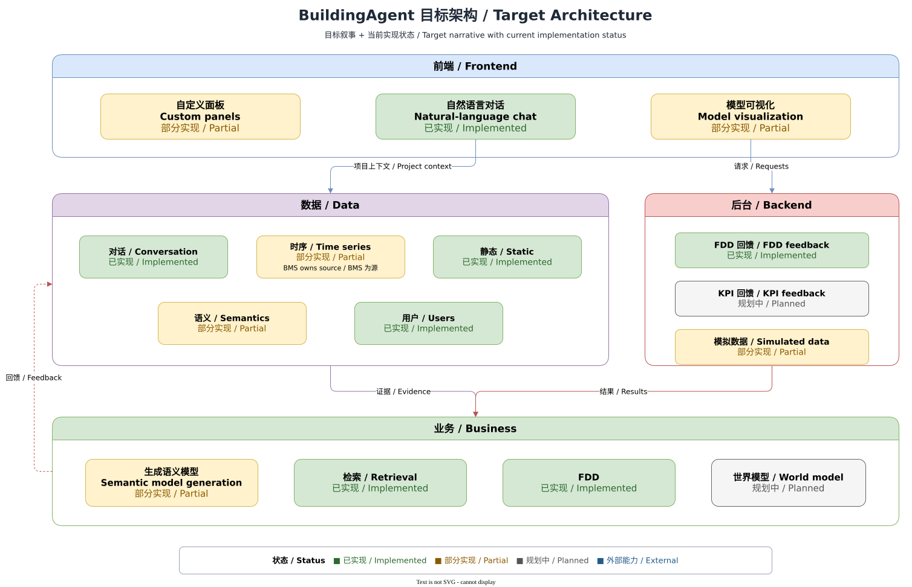

# Target architecture

[中文](../../zh-CN/architecture/target-architecture.md) | [Developer documentation home](../README.md) | [Current implementation](current-architecture.md)

> Code baseline: `main@af44ff15`; FDD status also includes the completed M007 candidate implementation. This page uses the hand-drawn framework as the target narrative.

## 1. Status and code baseline

The target architecture is fixed as four layers: frontend, data, backend, and business. Status reflects the overall project delivery view; the FDD section separately documents the integration boundary between candidate code and `main`.

| Layer | Capability | Status | Current evidence |
| --- | --- | --- | --- |
| Frontend | Custom panels | Partial | Dashboard definitions, widgets, and a workspace exist, but remain composed in the large `App.tsx`. |
| Frontend | Natural-language chat | Implemented | Web and CLI enter project-scoped Chat; the API supports JSON and SSE responses. |
| Frontend | Model visualization | Partial | Provider diagnostics, tool logs, and process state exist; there is no standalone general model-visualization workspace. |
| Data | Conversations | Implemented | Conversations, messages, and selection live in the JSON store with a SQLite session index. |
| Data | Time series | Partial / External | The API exposes BMS history/latest boundaries; the collector/BMS owns real acquisition and authoritative series. |
| Data | Static | Implemented | Project Knowledge Base, Repository, and uploaded material use project file directories. |
| Data | Semantics | Partial | Brick/TTL material, semantic retrieval, and report asset discovery exist; closed-loop automatic modeling does not. |
| Data | Users | Implemented | Bearer sessions, memberships, role permissions, and project selection exist; default accounts are public local fixtures. |
| Backend | FDD feedback | Implemented | FDD result materialization, Dashboard/LLM attribution, and update notifications are available. |
| Backend | KPI feedback | Planned | Derived Metrics/KPI foundations exist; no loop equivalent to the target box was found. |
| Backend | Simulated data | Partial | Deterministic mock provider, mock BMS, and test fixtures exist; this is not a general building simulator. |
| Business | Automatic modeling | Partial | Semantic material, retrieval, and report asset discovery exist without an end-to-end autonomous modeling product flow. |
| Business | Retrieval | Implemented | KB, Repository, Memory, conversation, and grounding retrieval are available to Agent tools. |
| Business | FDD | Implemented | The rule catalog, evaluation, deployability checks, Tasks, result materialization, and Web management surfaces are available. |
| Business | World model | Planned | Current code has no verifiable world-model Runtime or standalone contract. |

## 2. Purpose and scope

The target diagram is a stable responsibility map: users express intent through the frontend, the data layer provides project facts, backend capabilities perform deterministic or integrated work, and the business layer composes modeling, retrieval, and diagnosis experiences. It does not prescribe a deployment topology, and one box does not imply one service.

The Fastify API and React application remain modular code assembled into a monolithic process and SPA. The [current implementation](current-architecture.md) and source code are authoritative.

## 3. User and source entry points

- Web composition root: [apps/web/src/App.tsx](../../../../apps/web/src/App.tsx)
- API composition root: [apps/api/src/server.ts](../../../../apps/api/src/server.ts)
- Agent loop: [apps/api/src/agent/runtime.ts](../../../../apps/api/src/agent/runtime.ts)
- Tool registration: [apps/api/src/agent/genericTools.ts](../../../../apps/api/src/agent/genericTools.ts)
- Data-root resolution: [apps/api/src/agent/knowledgeBase.ts](../../../../apps/api/src/agent/knowledgeBase.ts)
- Rules and feedback boundary: [apps/api/src/projectRules.ts](../../../../apps/api/src/projectRules.ts), [apps/api/src/projectFeedback.ts](../../../../apps/api/src/projectFeedback.ts)

## 4. Normal data flow

1. A user signs in through Web or CLI and selects a project.
2. A natural-language request enters project-scoped Chat; the regular endpoint returns JSON and the streaming endpoint returns SSE.
3. Agent Runtime assembles conversation, KB/Repository, Memory, Grounding, Skills, and available Tools.
4. Tools read static, semantic, or time-series data and invoke deterministic Derived Metrics, BMS, Dashboard, or related capabilities; the FDD candidate covers catalog, evaluation, deployment, and materialization, while integration with the `main` report consumer remains separately tracked.
5. Results and provenance persist to the appropriate root; SSE reports current-request progress and WebSocket delivers cross-request updates.
6. Future feedback loops must build on deterministic facts and evidenced feedback; the LLM must not invent numbers or faults.

## 5. Data, state, and persistence

The target “data layer” is conceptual, not one database. Current implementation has at least two data roots—`apps/data/store.json` and configurable repository-root `data/**`—plus external BMS/collector and LLM providers. See [runtime and storage topology](runtime-storage.md) for authority boundaries.

## 6. Authorization and project isolation

Every project business entry point must verify membership and permissions after bearer authentication. Project id scopes messages, files, memory, dashboards, BMS requests, and WebSocket connections; the FDD candidate entry points follow the same project-scoping checks. Cross-layer arrows in the target diagram never bypass that check.

## 7. Errors, degradation, and external dependencies

- A deterministic mock is available without a real LLM; real-provider failures return canonical errors unless fallback is explicitly enabled.
- BMS/collector failure removes external series and point capabilities; mock output must never be documented as site data.
- Planned world-model and KPI-feedback capabilities have no callable fallback implementation.
- JSON persistence is best effort; production backup, concurrency, and recovery guarantees cannot be inferred from the target diagram.

## 8. Extension points

Classify a new capability by layer, authoritative data source, and project-isolation boundary before reusing existing registries and contracts. Promote Planned or Partial to Implemented only when route, Runtime, persistence, and verification evidence exist.

## 9. Tests

- Chat and provider: [apps/api/src/chat.test.ts](../../../../apps/api/src/chat.test.ts), [apps/api/src/providers.test.ts](../../../../apps/api/src/providers.test.ts)
- Web entry: [apps/web/src/App.test.tsx](../../../../apps/web/src/App.test.tsx)
- Project isolation: [apps/api/src/auth.test.ts](../../../../apps/api/src/auth.test.ts)
- Architecture gates: `npm run typecheck`, `npm run build`, and `npm run smoke`

## 10. Known limitations and related documentation

- Diagram status is a baseline snapshot and will change with code.
- World model is explicitly Planned; simulated data is not physical simulation.
- See [current implementation](current-architecture.md), [runtime and storage topology](runtime-storage.md), and [FDD overview](../fdd/overview.md).
