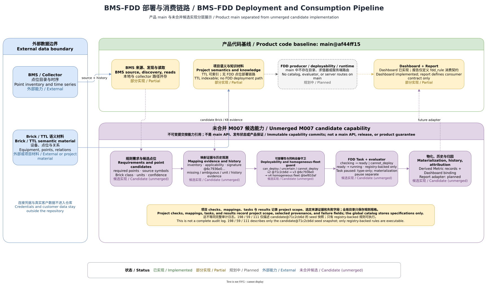

# Brick mapping and deployability

[中文](../../zh-CN/fdd/brick-deployability.md) | [Developer documentation home](../README.md) | [FDD overview](overview.md) | [Rule model and sources](rule-model-sources.md)

> Product code baseline: `main@af44ff15`. Status: Brick point mapping and FDD deployability checks are **Planned** on product `main`; that baseline has only the Reports-side `fdd_rule` evidence-consumer contract, with no FDD producer, catalog, deployability runtime, or dedicated routes. Every model and behavior discussed below is pinned to an unmerged M007 candidate commit, not a product API or release commitment.

The green area is the current product-`main` boundary; the purple area represents only unmerged candidate implementations pinned to immutable capability commits. The [Draw.io source](../../../assets/diagrams/bms-fdd-pipeline.drawio) remains available for review and re-export.

## 1. Status and code baseline

This page uses four immutable candidate snapshots to explain how the design became progressively stricter. They are not a released product-version sequence, and cached state cannot be reused directly across these policy versions.

| Baseline | Candidate capability | Fact boundary |
| --- | --- | --- |
| Product `main@af44ff15` | Reports can validate `fdd_rule` facts produced by an external fault tool. | There is no `apps/api/src/fdd/**`, Brick-to-point matcher, deployability check, or FDD route. |
| [`71c2cb6d…`](https://github.com/LiMingchen159/BuildingAgent/commit/71c2cb6d2c382348e6ccc47badea611183b0912d) | Defines `FddRequiredPoint`, candidates, mappings, the three-state check, and the `v2-observed-history` policy. | This is an unmerged base candidate; a Brick class remains a matching hint and cannot prove that a project's equipment inventory is complete. |
| [`6c7936e0…`](https://github.com/LiMingchen159/BuildingAgent/commit/6c7936e01a249a134b758c02f6454d67f961ec23) | Adds an equipment-first inventory, minimal Brick facts, unit validation, observed-history probes, and `v3-equipment-first`. | It is still a candidate; the minimal Turtle parser is not a complete RDF/Brick reasoner. |
| [`bef810af…`](https://github.com/LiMingchen159/BuildingAgent/commit/bef810af291665bcaaf1b8b3bda185bdb663a19b) | Adds a homogeneous template, all-entity coverage guard, and `v4-homogeneous-fleet` for multiple chillers. | It proves only the guard in that candidate implementation and its tests; it does not prove that arbitrary equipment families are homogeneous. |
| [`c27a3af2…`](https://github.com/LiMingchen159/BuildingAgent/commit/c27a3af2dca6b04fe731b6fc11f83e9608f10943) | Adds characterization tests for fleet deployability. | This commit changes tests only and must not be described as a new product implementation. |

Consequently, “Implemented” on this page always means “code and tests exist in the named candidate snapshot”; for product `main`, the capability remains Planned. The candidate catalog's `198 / 59 / 111` boundary is documented in [Rule model and sources](rule-model-sources.md); those figures are neither `main` response values nor project deployability counts.

## 2. Purpose and boundary

A deployability check answers one narrow question: **can one versioned rule obtain an unambiguous, per-entity complete input mapping, with satisfactory unit and history evidence, across the currently confirmed equipment set in this project?** It should run before an evaluator starts and leave anything that cannot be decided automatically for engineering review.

It does not:

- decide whether the rule formula is scientifically valid, whether thresholds fit the site, or whether a fault diagnosis is correct;
- treat a Brick class in a source document as a live point id;
- promote “one similar point name was found” into proof of complete inventory, convertible units, or sufficient history;
- produce fault events, execute evaluators, materialize results, or generate reports; those belong to later runtime/consumer boundaries; or
- let free-form LLM text replace deterministic mapping, three-state evaluation, or project authorization.

Three similarly named objects must remain distinct: `FddDefinitionStatus` describes whether the rule specification is clear, `FddDeployabilityStatus` describes whether current project inputs are ready, and `FddTaskStatus` describes the candidate task lifecycle such as checking, ready, or running. `implementation_ready` does not mean `can_deploy`, and `can_deploy` does not mean `running`.

## 3. User entry and key source entry

Product `main` has no stable FDD Library, Test, Deploy, or Task Web/API entry. See [Current implementation architecture](../architecture/current-architecture.md) for the product boundary. The current Reports-side consumer ports are [evidenceDefinitions.ts](../../../../apps/api/src/reports/evidenceDefinitions.ts) and [evidenceExecutor.ts](../../../../apps/api/src/reports/evidenceExecutor.ts).

The following are immutable candidate-source evidence only:

- base required-point, candidate, mapping, check, and three-state evaluator: [M007 `library.ts` at `71c2cb6d…`](https://github.com/LiMingchen159/BuildingAgent/blob/71c2cb6d2c382348e6ccc47badea611183b0912d/apps/api/src/fdd/library.ts)
- source-symbol/Brick-class normalization and preservation: [M007 `importedEquipmentLibrary.ts` at `71c2cb6d…`](https://github.com/LiMingchen159/BuildingAgent/blob/71c2cb6d2c382348e6ccc47badea611183b0912d/apps/api/src/fdd/importedEquipmentLibrary.ts)
- minimal Brick facts, unit aliases, and inventory signatures: [M007 `equipmentEvidence.ts` at `6c7936e0…`](https://github.com/LiMingchen159/BuildingAgent/blob/6c7936e01a249a134b758c02f6454d67f961ec23/apps/api/src/fdd/equipmentEvidence.ts)
- equipment-first context, candidate lookup, history probes, and candidate routes: [M007 `server.ts` at `6c7936e0…`](https://github.com/LiMingchen159/BuildingAgent/blob/6c7936e01a249a134b758c02f6454d67f961ec23/apps/api/src/server.ts)
- homogeneous template and all-entity coverage guard: [M007 `server.ts` at `bef810af…`](https://github.com/LiMingchen159/BuildingAgent/blob/bef810af291665bcaaf1b8b3bda185bdb663a19b/apps/api/src/server.ts)
- fleet characterization tests: [M007 `fddHomogeneousFleet.test.ts` at `c27a3af2…`](https://github.com/LiMingchen159/BuildingAgent/blob/c27a3af2dca6b04fe731b6fc11f83e9608f10943/apps/api/src/fddHomogeneousFleet.test.ts)

Candidate `server.ts` versions declared project-scoped `fdd-library/.../test`, `.../deploy`, and `fdd-tasks` routes, but those routes are absent from the product baseline. Clients, integrations, and this documentation must not treat those candidate paths as `main` contracts.

## 4. Normal data flow

The candidate design follows this deterministic path; product `main` currently has no such producer chain.

1. **Read rule requirements.** Each required slot supplies semantics, quantity kind, unit role, acceptable units, keywords, source symbols/Brick classes, and minimum/preferred history days. A source Brick class is a search hint, not a bound point.
2. **Confirm the equipment set first.** `6c7936e0…` gathers equipment/point facts from project `KB_CATALOG_SUMMARY.md` and `brick_model.ttl`. Only an explicit “complete inventory” marker combined with Brick equipment facts makes absence authoritative as `not_available`; otherwise it remains `unknown`.
3. **Generate point candidates.** Candidate generation combines project equipment aliases, KB vocabulary, minimal Brick class/`isPointOf` facts, and an external BMS point catalog. Each item preserves the slot, point name, entity key, object reference, unit compatibility, dimension reason, confidence, reason, and optional history days.
4. **Reject or rank.** Candidates with dimensionally incompatible units enter `rejectedCandidates`. Remaining candidates are ranked by raw confidence plus deterministic formula-role weighting, for example distinguishing run status from flow status, supply from return temperature, and power from energy.
5. **Validate observed history.** For the deterministic winner of each entity/slot, the candidate service verifies coverage through an external readings interface. Unknown coverage or fewer than the required point's `minDays` enters `historyIssues`; it is not interpreted as zero faults.
6. **Build per-entity mappings.** One point is selected for every required slot. Missing inputs, close candidates, low confidence, unknown units, and history problems remain explicit. A mapping stores slot, point name, object reference, and unit, not copied raw time-series data.
7. **Apply the homogeneous fleet guard.** For multiple chillers, `bef810af…` can derive a point-family template from one complete entity, but it still requires every current-inventory entity to have a same-family counterpart and recomputes the three-state result per entity. It does not copy the example mapping onto the rest.
8. **Sign the check.** The check records algorithm version, policy version, project-data signature, equipment-inventory signature, check time, and source. Deployment revalidates those signatures, freshness, and all-entity coverage, so an old check cannot authorize a new deployment directly.

## 5. Data, state, and persistence

### 5.1 Mapping and evidence objects

| Object/field | Candidate role | Explicitly does not mean |
| --- | --- | --- |
| `FddRequiredPoint.sourceSymbols / sourceBrickClasses` | Preserves formula symbols and Brick classes from the rule source for search and review. | A project point id, complete Brick graph, or validated relationship. |
| `FddPointCandidate` | Stores a slot candidate, equipment, object reference, unit decision, confidence, reason, and history days. | An authoritative mapping, diagnostic probability, or model accuracy. |
| `FddPointMapping` | Stores the deterministically selected slot → point binding. | A raw time-series copy, persistent alarm, or cross-project shared mapping. |
| `FddEntityDeployability` | Stores one entity's state, mappings, ambiguities, gaps, history issues, and aggregate confidence. | Proof that the whole fleet passed. |
| `FddDeployabilityCheck` | Binds project, algorithm/policy versions, equipment/data signatures, candidates, rejections, and check time. | Permanent authorization or an evaluator result. |

The `FddUnitCompatibility` type includes `match / convertible / mismatch / unknown`, but the unit helper in `6c7936e0…` **normalizes spelling/symbol aliases only; it does not convert values**. For example, `°C` and `degC` can be the same alias, while `degF` is not accepted automatically as `degC` merely because it is physically convertible. Conversion requires a versioned, tested transformation applied to values, not just an enum change.

### 5.2 Authoritative data and derived state

| Layer | Authority/lifecycle in the candidate |
| --- | --- |
| Project KB and `brick_model.ttl` | Project user files; absence becomes authoritative only when a completeness declaration is combined with parseable equipment facts. The minimal parser recognizes only a limited Turtle subset. |
| BMS point catalog/readings | External authoritative systems; the candidate reads catalog identity, object reference, unit, and history coverage but does not own raw time series. |
| Point candidates and confidence | Rebuildable derived index/decision; regenerate when data, rules, or ranking changes. |
| Deployability check | Cached authorization evidence in the candidate project store; constrained by algorithm version, policy version, project-data signature, inventory signature, and freshness. |
| Selected mapping | Part of a check snapshot; meaningful only in the same project, equipment-set, and rule-version context. |

These fields describe an unmerged candidate store, not the product-`main` `apps/data/store.json` schema. `projectDataSignature` and the inventory SHA-256 help detect changed input evidence; they do not prove that the semantic model is correct or replace concrete evidence-source provenance.

## 6. Permissions and project isolation

Candidate routes authenticate the session and then apply a project-membership guard to the URL `projectId`. Candidate checks, library-check runs, tasks, and mappings are grouped by project, and `FddDeployabilityCheck.projectId` is persisted with the result. Global builtin/community rules share specifications only; project point names, object references, equipment inventories, history evidence, thresholds, and check signatures must never enter the global catalog.

The server must resolve the KB root and BMS access from the authorized project. It must not accept a mapping for another project from a client or retrieve a cross-project object merely by algorithm id or task id. The candidate membership guard demonstrates only a member boundary and does not define fine-grained FDD read/test/deploy/override permissions. Productization should design those permissions separately and require stronger authorization plus audit records for bulk deployment.

An Agent/LLM may help generate search terms or present reasons, but final candidates, rejections, history evidence, and the three-state decision must reside in the current project's structured check. Cross-project memory, KB text, BMS credentials, or point evidence must not enter that decision.

## 7. Errors, degradation, and external dependencies

| Condition | Candidate degradation | Reason |
| --- | --- | --- |
| The authoritative inventory explicitly has no target equipment | `cannot_deploy` with `applicability: no_equipment`; do not query the point catalog. | There is no applicable entity, so continued searching would create false matches. |
| Equipment inventory is incomplete or Brick evidence is absent | `cannot_deploy` with `applicability: unknown`; preserve the evidence issue. | “Not observed” cannot be treated as authoritative absence. |
| A required slot has no candidate | `cannot_deploy` plus `missingPoints`. | The evaluator lacks an input. |
| History is unknown/insufficient or a readings call fails | `cannot_deploy` plus `historyIssues`. | The detection window cannot be proven computable. |
| Best confidence is below the candidate threshold, near alternatives cannot be separated, or the unit is unknown | `uncertain` plus `ambiguousInputs`. | Human confirmation is required; automatic authorization is unsafe. |
| Unit dimension is incompatible | Move the candidate to `rejectedCandidates`. | Do not convert or guess implicitly. |
| One fleet entity lacks a counterpart, maps duplicate roles, or is not `can_deploy` | Block the entire deployment. | Fleet authorization must be complete with distinct point roles. |
| Algorithm/policy/project-data/inventory signature changes, or the check expires | Recheck; the old cache does not authorize. | Old evidence no longer describes the current inputs. |

External dependencies include project KB files, constrained Brick Turtle data, the BMS point catalog, and the readings service. Their failure must preserve `unknown`, `uncertain`, or `cannot_deploy`, never fall back to `can_deploy`. LLM failure should affect only deep inference/explanation and must not alter the deterministic core result.

## 8. Extension method

When adding an equipment type, point role, or semantic source, extend the candidate design in this order:

1. Add a stable slot, quantity kind, unit role, acceptable units, source symbol/Brick class, and history requirement to the rule specification; never put a site point id into a global rule.
2. Add a minimal, tested Brick-class → equipment/point-role mapping to the project inventory parser. If complete RDF reasoning is required, introduce an explicit Brick/RDF component instead of silently widening a regex parser's promise.
3. Make candidate generation preserve every evidence source, dimension decision, rejection reason, and entity association. Ranking must be deterministic and reproducible, with negative cases for namesakes, near neighbors, and wrong roles.
4. Unit conversion requires an explicit conversion id, direction, ratio/offset, source/target units, and value-level tests. Until then, preserve mismatch/unknown and do not use `convertible` to bypass computation.
5. Bump the policy version whenever evidence required by `can_deploy` changes, and move old caches and running instances through reauthorization.
6. A new fleet template must first establish a homogeneous family, then validate a complete, unique, and role-distinct required-slot mapping per entity. Any entity failure should atomically block Deploy All.
7. Add timeout, no-data, pagination, missing-unit, and history-boundary tests for every external adapter, preserving project id through reads, signatures, and persistence.

To move the candidate into the product, redesign REST/type/store contracts under separate issues and adapt deterministic results to the product's existing `FaultEvidenceTool` consumer port. Do not treat a long-lived candidate `server.ts` as an approved implementation.

## 9. Corresponding tests

Product `main@af44ff15` has no deployability tests because it has no such producer. The only product regression here is external fact consumption on the Reports side: [evidenceExecutor.test.ts](../../../../apps/api/src/reports/evidenceExecutor.test.ts) verifies `fdd_rule` tool outcomes, scope, and evidence consistency; it does not test Brick mapping.

Candidate evidence must run in a clean worktree containing the corresponding commit:

- [`fddLibrary.test.ts` at `71c2cb6d…`](https://github.com/LiMingchen159/BuildingAgent/blob/71c2cb6d2c382348e6ccc47badea611183b0912d/apps/api/src/fddLibrary.test.ts): three states, missing points, unverified history, near-neighbor role ranking, and catalog/runtime alignment.
- [`equipmentEvidence.test.ts` at `6c7936e0…`](https://github.com/LiMingchen159/BuildingAgent/blob/6c7936e01a249a134b758c02f6454d67f961ec23/apps/api/src/fdd/equipmentEvidence.test.ts): complete-inventory marker, minimal Brick facts, unit aliases, and inventory signatures.
- [`bms.test.ts` at `6c7936e0…`](https://github.com/LiMingchen159/BuildingAgent/blob/6c7936e01a249a134b758c02f6454d67f961ec23/apps/api/src/bms.test.ts): equipment-first applicability, BMS candidate/history evidence, and legacy-policy/signature revalidation.
- [`fddHomogeneousFleet.test.ts` at `bef810af…`](https://github.com/LiMingchen159/BuildingAgent/blob/bef810af291665bcaaf1b8b3bda185bdb663a19b/apps/api/src/fddHomogeneousFleet.test.ts): the complete eight-chiller template, blocking when one counterpart is absent, preventing a noisy high-confidence candidate from replacing the same-family mapping, and atomic deployment.
- [`fddHomogeneousFleet.test.ts` at `c27a3af2…`](https://github.com/LiMingchen159/BuildingAgent/blob/c27a3af2dca6b04fe731b6fc11f83e9608f10943/apps/api/src/fddHomogeneousFleet.test.ts): later fleet-contract characterization tests.

The 52 passing targeted FDD cases recorded during M011 preparation belong to the candidate work line, not the product-`main` test count. Commands, environment, and final regression results are centralized in [Testing and verification](../development/testing.md).

## 10. Known limitations and related documentation

- Product `main` has none of the producer, Brick matcher, deployability store/API, or fleet deployment described here; the only current boundary is Reports consuming external `fdd_rule` facts.
- The candidate minimal Turtle parser recognizes only a constrained subset of prefixed subjects, `a brick:Class`, labels, `brick:isPointOf`, and unit hints; it does not validate a complete RDF graph.
- Source-rule Brick classes, project Brick facts, BMS descriptions, and point names may all be incomplete or wrong. Confidence is a ranking heuristic, not a statistically calibrated probability.
- `6c7936e0…` normalizes unit aliases but performs no conversion; the existence of a `convertible` type is not a conversion implementation.
- The homogeneous template in `bef810af…` explicitly targets multiple chillers. It cannot be extrapolated to pumps, AHUs, FCUs, cooling towers, or VAVs, nor does it establish that all equipment of one type is homogeneous.
- Candidate routes have only a membership-style boundary; fine-grained FDD operation permissions, audit, concurrency conflicts, and production rollback still require design.
- Different candidate policy versions show that the contract is evolving. Passing tests at a fixed commit are not a site-commissioning result, detection-accuracy claim, or product-support commitment.

Continue with [Runtime and materialization](runtime-materialization.md), [Verification and sample provenance](verification-provenance.md), [BMS integration](../features/bms-integration.md), [Runtime and storage topology](../architecture/runtime-storage.md), and [API event contracts](../architecture/api-events.md).
