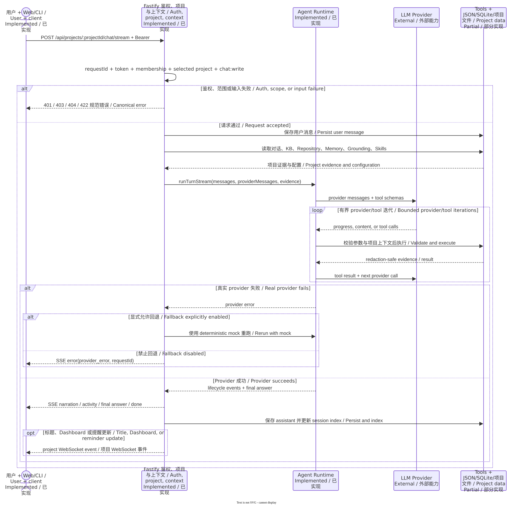

# Chat and Agent Runtime

[中文](../../zh-CN/features/chat-agent-runtime.md) | [Developer documentation home](../README.md) | [Interfaces and events](../architecture/api-events.md)

> Code baseline: `main@af44ff15`. Status: synchronous Chat, SSE Chat, and the multi-turn provider/tool loop are Implemented; a real LLM is External.

## 1. Status and code baseline

[server.ts](../../../../apps/api/src/server.ts) exposes synchronous `POST /api/projects/:projectId/chat` and streaming `POST .../chat/stream`. [runtime.ts](../../../../apps/api/src/agent/runtime.ts) implements the multi-turn Agent loop after context assembly; [providers.ts](../../../../apps/api/src/providers.ts) resolves a mock or OpenAI-compatible provider. These are composed in one Fastify process, not deployed as a separate Agent service.

The core loop, parallel tools, and SSE are **Implemented**. Provider quality, availability, and model capability are **External**. Missing credentials are not silently represented as a real model: deterministic mock behavior requires an explicit mock provider or enabled fallback.

## 2. Purpose and scope

The Chat route owns HTTP authorization, conversation selection, message persistence, and protocol output. Agent Runtime owns system context, provider calls, tool execution, loop termination, and result validation. Deterministic reminder expressions are handled by the route before entering the LLM. Dashboard, BMS, Memory, and other tools remain the calculators and sources of business facts; the LLM selects tools and composes the answer.

## 3. User and source entry points

- Web streaming client: [apps/web/src/api.ts](../../../../apps/web/src/api.ts)
- HTTP assembly, message lifecycle, and fallback: [apps/api/src/server.ts](../../../../apps/api/src/server.ts)
- Agent loop and events: [apps/api/src/agent/runtime.ts](../../../../apps/api/src/agent/runtime.ts)
- Provider configuration, retry, and error redaction: [apps/api/src/providers.ts](../../../../apps/api/src/providers.ts)
- Prompt boundaries: [apps/api/src/agent/systemPrompt.ts](../../../../apps/api/src/agent/systemPrompt.ts)
- Context compression: [apps/api/src/agent/compressor.ts](../../../../apps/api/src/agent/compressor.ts)
- Tools and skills: [apps/api/src/agent/genericTools.ts](../../../../apps/api/src/agent/genericTools.ts), [apps/api/src/agent/skills.ts](../../../../apps/api/src/agent/skills.ts)

## 4. Normal data flow

1. The route validates token, membership, selected project, `chat:write`, and a 1–1000-character message. It creates a conversation when no id is supplied.
2. The user message is written to the project message pool, conversation, and session search index. The synchronous path persists immediately; the SSE path persists before streaming begins.
3. `buildAgentTurnInputs` selects ordered messages from only the active conversation and scans `data/<project>/kb` and `repository` to build provider history and file catalogs.
4. Runtime retrieves project Grounding, loads playbooks, a Memory snapshot, and project Skills, then composes kernel bounds, time/language, tool schemas, and KB/Repository summaries into the system prompt.
5. Each provider iteration returns final text or tool calls. Calls in the same iteration are dispatched in parallel under `BUILDING_AGENT_TOOL_CONCURRENCY` (default 8), while results are appended in original tool-call order before the next provider call.
6. The default maximum is 20 iterations. Long contexts first prune tool rows and then use threshold-based compression. At the limit, Runtime makes one final no-tools summary call.
7. The final answer is sanitized and checked against retrieved Grounding rules. Images are retained only when a trusted tool generated them and the answer references them; downloads merge tool results with normalized `outputs/...` links. The server stores the assistant message and returns JSON or SSE `done`.

The diagram distinguishes ordinary success, explicit fallback, and streaming-error branches; internal lifecycle events do not map one-for-one to public SSE events.

## 5. Data, state, and persistence

The authoritative local message/conversation state is in `apps/data/store.json`. `data/session_index.db` is a search index rebuilt from messages. Memory, the Grounding index, KB, Repository, tool logs, and generated outputs live under repository-root `data/**`. Agent Runtime has no independent database.

Tool activities, generated images, downloads, and `workDuration` are persisted with the assistant message. A synchronous response also returns a lifecycle array. SSE maps selected Runtime lifecycle concepts into user-visible activity/narration/answer events instead of exposing every internal event one for one.

## 6. Authorization and project isolation

Both Chat POST routes require the selected project and `chat:write`. A Runtime request explicitly carries `projectId`, `userId`, `conversationId`, `requestId`, and `canConfigure`; the tool registry uses them to constrain file roots, logs, and configuration writes. `canConfigure` comes only from membership `project:configure` and cannot be elevated by model arguments.

KB/Repository scans resolve directories from the current project id, and history is taken only from the active conversation. A new tool must continue to consume tool context rather than accept an arbitrary model-supplied project root.

## 7. Errors, degradation, and external dependencies

- With no configured provider, or when a provider fails and fallback is disabled, synchronous Chat returns `502 provider_error`; SSE emits `error` and closes.
- When `BUILDING_AGENT_LLM_ALLOW_FALLBACK` (or a compatible variable) is explicitly enabled, a failure logs redacted diagnostics and reruns with the deterministic mock.
- A failed provider stream falls back to a non-streaming call. Retriable errors use backoff, with a longer wait for rate limits.
- An unknown, throwing, or domain-failing tool becomes a structured tool result so the provider can explain or correct it; that does not mean the business operation succeeded.
- If the connection closes without `done` or `error`, the client reports `stream_incomplete`. The user question may already be stored, so retrying can repeat side effects.
- LLMs, BMS, web search, speech, and site systems are External dependencies; a local fallback cannot replace real data.

## 8. Extension points

A provider implementation should satisfy `ChatProvider`, expose only redacted metadata, and preserve ordered assembly of tool-call deltas. A tool should register a JSON schema, use `AgentToolContext`, return deterministic serializable results, and check `canConfigure` or a narrower permission for writes. A new SSE event requires server emission, Web parsing, event documentation, and tests together; an internal lifecycle type is not automatically a public SSE contract.

## 9. Tests

- Synchronous Chat, permissions, fallback, files, and conversations: [apps/api/src/chat.test.ts](../../../../apps/api/src/chat.test.ts)
- Work/final-answer phase gating: [apps/api/src/agent/runtime.streamPhase.test.ts](../../../../apps/api/src/agent/runtime.streamPhase.test.ts)
- Same-iteration tool parallelism and message order: [apps/api/src/agent/runtime.toolParallel.test.ts](../../../../apps/api/src/agent/runtime.toolParallel.test.ts)
- Context compression: [apps/api/src/agent/compressor.test.ts](../../../../apps/api/src/agent/compressor.test.ts)
- Tool-result compaction: [apps/api/src/agent/toolResultCompaction.test.ts](../../../../apps/api/src/agent/toolResultCompaction.test.ts)
- Web streaming rendering: [apps/web/src/App.test.tsx](../../../../apps/web/src/App.test.tsx)

## 10. Known limitations and related documentation

- `server.ts` combines protocol, persistence, and multiple domain assemblies; the documentation layers do not mean these are separate services.
- The default 20 iterations and concurrency 8 are process settings, not per-project quotas or distributed scheduling.
- Tool side effects have no unified transaction across JSON, SQLite, files, and external systems.
- The SSE recurring-reminder fast path double-encodes its `done` data at this baseline, unlike the ordinary Chat `done` object; callers should not promote that difference into a new standard.
- Continue with [Tools, Skills, Memory, and Grounding](tools-skills-memory-grounding.md), [Knowledge Base and Repository](knowledge-base-repository.md), and [runtime and storage topology](../architecture/runtime-storage.md).
