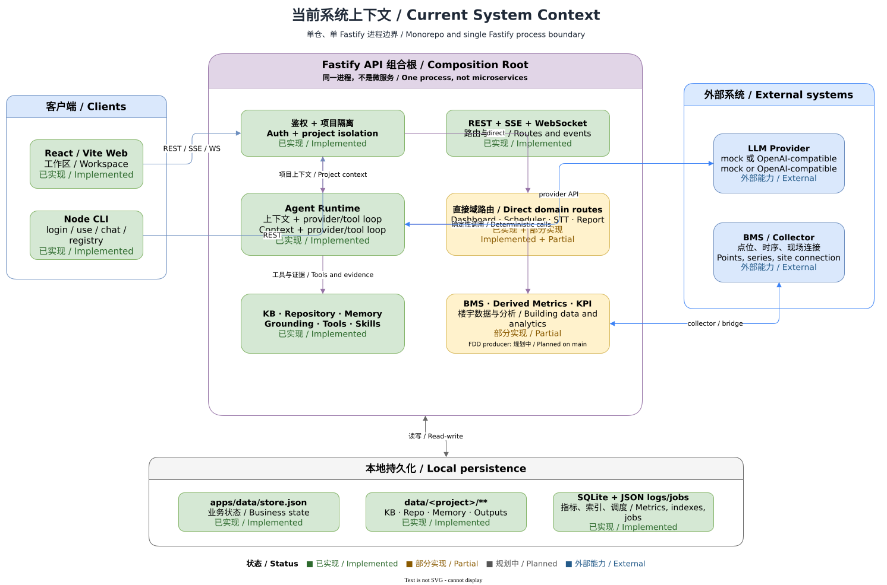

# 当前实现架构

[English](../../en/architecture/current-architecture.md) | [开发者文档首页](../README.md) | [目标架构](target-architecture.md)

> 代码基线：`main@af44ff15`。状态：已实现的单仓应用，含部分能力与外部集成边界。



## 1. 状态与代码基线

BuildingAgent 是 npm workspaces 管理的 TypeScript 单仓库：`@building-agent/web` 是 React/Vite SPA，`@building-agent/api` 是 Fastify/Node 服务，`@building-agent/cli` 是 Node CLI。它们共享 API 契约行为，但没有独立的共享类型发布包。

[server.ts](../../../../apps/api/src/server.ts) 同时装配鉴权、项目、Chat、WebSocket、BMS、FDD、Dashboard、Scheduler 等路由和服务；[App.tsx](../../../../apps/web/src/App.tsx) 同时装配登录、导航、工作区和多类功能 UI。两者是大型组合根，文档按责任域拆解只是阅读方式，不表示代码已经拆成微服务或微前端。

## 2. 功能目的及边界

当前架构图回答“请求实际经过哪里”：Web/CLI 是受信任程度相同的客户端；Fastify 负责鉴权和项目隔离；Agent Runtime 决定 provider/tool loop；楼宇域模块与外部 LLM/BMS 交互；本地 JSON、SQLite 和项目文件保存不同类别状态。

图中边界不是网络部署保证。除外部系统外，大多数 API 能力在同一个 Fastify 进程中运行。

## 3. 用户入口和关键源码入口

| 责任 | 入口 | 说明 |
| --- | --- | --- |
| Web | [apps/web/src/main.tsx](../../../../apps/web/src/main.tsx)、[App.tsx](../../../../apps/web/src/App.tsx) | Vite 启动，浏览器 API client 使用 `/api`。 |
| CLI | [apps/cli/src/index.ts](../../../../apps/cli/src/index.ts) | 保存本地连接/令牌配置后调用同一 API。 |
| API | [apps/api/src/index.ts](../../../../apps/api/src/index.ts)、[server.ts](../../../../apps/api/src/server.ts) | 启动 Fastify 并装配全部路由。 |
| Agent | [apps/api/src/agent/runtime.ts](../../../../apps/api/src/agent/runtime.ts) | 管理 provider 输出、工具调用、并行/循环限制与流事件。 |
| 楼宇能力 | `apps/api/src/{bms*,fdd*,derivedMetrics*}` | BMS 桥接、FDD 目录/求值、派生指标。 |
| 持久化 | [persistence.ts](../../../../apps/api/src/persistence.ts)、[knowledgeBase.ts](../../../../apps/api/src/agent/knowledgeBase.ts) | 分别解析 JSON store 和项目数据根。 |

## 4. 正常数据流

```text
Web / CLI
  -> Fastify request id + bearer authentication
  -> membership / permission / project scope
  -> direct domain route OR Agent Runtime
  -> provider and/or deterministic tools
  -> JSON response or SSE stream
  -> JSON / SQLite / project-file persistence
  -> optional WebSocket project broadcast
```

直接域路由（例如 Dashboard CRUD、BMS 批量读取）不必经过 LLM。Chat 可以调用确定性工具，但最终回答和工具结果仍受同一个 project id 约束。

## 5. 数据、状态及持久化

- `apps/data/store.json`：用户、token、项目、成员关系、消息、会话、Dashboard 与多种项目配置的内存模型快照。
- 根 `data/**`（可由 `BUILDING_AGENT_DATA_DIR` 覆盖）：项目 KB/Repository、Memory、输出、日志，以及 SQLite/调度文件。
- 外部 LLM：不应成为本地业务事实的权威存储。
- 外部 BMS/collector：真实点位和时序的权威来源；本地可能保存连接元数据、映射或派生结果。

详见[运行时与存储拓扑](runtime-storage.md)。

## 6. 权限与项目隔离

`/health` 以外的业务路径通常需要 bearer token。受保护路由通过用户 id、membership 和 permission 校验项目访问；WebSocket 在 upgrade 时执行 token 和 `chat:read` 检查。只把 project id 放入 URL 并不构成授权。

CLI 配置和浏览器状态不是服务端授权来源。服务端必须独立验证每次请求。

## 7. 错误、降级及外部依赖

- Fastify 使用带 request id 的规范错误封装；validation、空 JSON body 和未捕获异常分别处理。
- Chat 无凭据时使用 mock；真实 provider 故障默认失败，显式允许时才回退。
- BMS 可以使用 mock/桥接/collector proxy，不同路由的权威方不同。
- SQLite 索引可重建不代表 JSON store 或项目文件可丢弃。
- API/Web 构建通过时仍可能出现 Web bundle 大于 500 kB 的性能警告。

## 8. 扩展方法

在现有单体边界中，优先把实现放入明确域模块，再由组合根注册。新增 API 时同时更新服务端路由、Web/CLI client、权限检查、错误契约和测试；不能只在前端声明方法。只有出现独立部署、版本和故障边界后，文档才应称其为服务。

## 9. 对应测试

- 服务装配和主链路：[apps/api/src/chat.test.ts](../../../../apps/api/src/chat.test.ts)
- 鉴权：[apps/api/src/auth.test.ts](../../../../apps/api/src/auth.test.ts)
- Web 组合：[apps/web/src/App.test.tsx](../../../../apps/web/src/App.test.tsx)
- CLI：[apps/cli/src/commands.test.ts](../../../../apps/cli/src/commands.test.ts)
- 端到端本地门禁：`npm run smoke`

## 10. 已知限制及关联文档

- 组合根规模使跨域变更风险升高；本里程碑只记录，不重构。
- 前端部分 BMS client 方法没有对应 Fastify 路由；参阅[BMS 集成](../features/bms-integration.md)。
- 仓库当前没有实际 GitHub Actions workflow；参阅[测试与验证](../development/testing.md)。
- 事件细节见 [REST、SSE 与 WebSocket 契约](api-events.md)。

