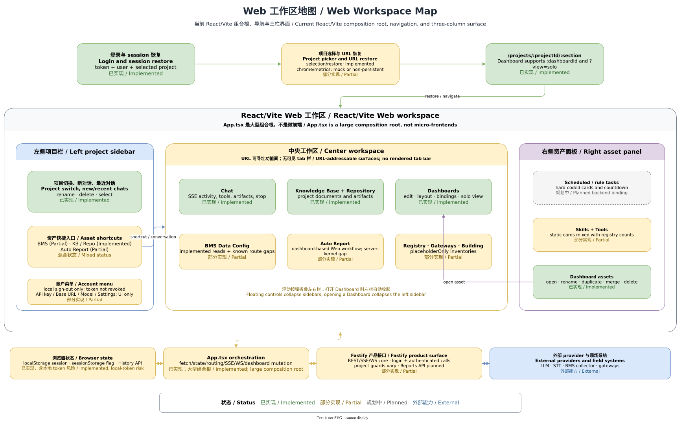

# Web 工作区

[English](../../en/features/web-workspace.md) | [开发者文档首页](../README.md) | [Draw.io 源文件](../../../assets/diagrams/web-workspace-map.drawio)

> 代码基线：`main@af44ff15`。状态：登录、项目选择、三栏工作区和主要业务页面为 **已实现**；导航完整性及部分面板数据为 **部分实现**；独立模型调试台为 **规划中**。



## 1. 状态与代码基线

[App.tsx](../../../../apps/web/src/App.tsx) 统一装配登录、项目恢复、URL 同步、会话、Chat 流、BMS、知识库、Repository、Dashboard、Auto Report、registry/management 占位面板和 WebSocket 状态。它是 React SPA 的大型组合根，不是微前端容器；本文按界面责任域拆解，只是阅读视图。

| 界面能力 | 状态 | 当前事实 |
| --- | --- | --- |
| 登录、项目选择、会话与中央 Chat | 已实现 | 使用真实 Web API client，并由 Fastify 端再次执行鉴权和项目隔离。 |
| 左栏、中央区、可折叠右栏 | 已实现 | [WorkspaceShell.tsx](../../../../apps/web/src/ui/WorkspaceShell.tsx) 提供三个带 ARIA 标签的区域。 |
| BMS、知识库、Repository、Dashboard、Auto Report | 已实现/部分实现 | 页面已接入；各领域仍有自身契约差距，不能由“可打开”推断为完整产品能力。 |
| Registry、Gateways、Building Domain | 部分实现 | 中央面板和 URL 分支存在，但内容明确是 placeholder/synthetic，且没有可见的完整 tab 导航。 |
| 右栏 Tasks、Skills、Tools | 部分实现 | Dashboard 列表来自项目状态；前三类卡片仍由静态示例组件渲染。 |
| 模型调试与账号配置 | 规划中 | provider 诊断会随 Chat 显示，但账号菜单中的 API key、Base URL、Model、Settings 没有操作处理器。 |

## 2. 功能目的及边界

Web 工作区把“用户是谁、正在操作哪个项目、当前打开哪个功能面”组合为一个浏览器交互壳。它负责展示、客户端状态协调和调用 API，不是权限、业务数据或调度结果的权威来源。

登录后先显示项目选择器；选中项目后进入左侧项目/会话/资产入口、中央活动页面、右侧任务/技能/工具/Dashboard 资产栏。Dashboard 还支持 `?view=solo` 独立视图。目标架构中的自定义面板和自然语言对话已有落点；独立模型调试台、世界模型等目标不应从现有菜单文字推断为已实现。

## 3. 用户入口和关键源码入口

- SPA 启动：[apps/web/src/main.tsx](../../../../apps/web/src/main.tsx)
- 大型组合根、路径解析和页面切换：[apps/web/src/App.tsx](../../../../apps/web/src/App.tsx)
- REST、SSE 与 WebSocket client：[apps/web/src/api.ts](../../../../apps/web/src/api.ts)
- 三栏语义结构：[WorkspaceShell.tsx](../../../../apps/web/src/ui/WorkspaceShell.tsx)、[LeftSidebar.tsx](../../../../apps/web/src/ui/LeftSidebar.tsx)、[CenterWorkspace.tsx](../../../../apps/web/src/ui/CenterWorkspace.tsx)、[RightPanel.tsx](../../../../apps/web/src/ui/RightPanel.tsx)
- 中央功能组件：[BmsDataConfig.tsx](../../../../apps/web/src/ui/BmsDataConfig.tsx)、[KnowledgeBase.tsx](../../../../apps/web/src/ui/KnowledgeBase.tsx)、[Repository.tsx](../../../../apps/web/src/ui/Repository.tsx)、[DashboardView.tsx](../../../../apps/web/src/ui/DashboardView.tsx)、[AutoReport.tsx](../../../../apps/web/src/ui/AutoReport.tsx)
- 右栏组件：[ScheduledTasks.tsx](../../../../apps/web/src/ui/ScheduledTasks.tsx)、[Skills.tsx](../../../../apps/web/src/ui/Skills.tsx)、[Tools.tsx](../../../../apps/web/src/ui/Tools.tsx)

`App.tsx` 自行使用 `history.pushState` 和 `popstate`，没有路由框架。已解析的路径是 `/projects/:projectId/{chat|bms-data-config|kb|repo|dashboards|autoreport|registry|gateways|building}`，Dashboard 详情为 `/projects/:projectId/dashboards/:dashboardId`；conversation id 不在 URL 中。

## 4. 正常数据流

1. 首次挂载读取 `building-agent.session.v1`；有保存 token 时并行请求 session 和可访问项目，否则显示登录页。
2. 显式登录会清空项目选择并回到 `/`。恢复时按“URL 中的项目 → 服务端 session 项目 → localStorage 项目”选择；显式登录设置的一次性 sessionStorage 标志会阻止立即恢复旧项目。
3. 选择项目后，client 先调用 select，再加载 registry、project management、conversation、Chat、知识库、Repository 和 Dashboard 摘要；核心状态集中保存在 `App` 的 React state。
4. 左栏切换项目或 conversation，并打开 BMS、知识库、Repository、Auto Report；“New chat”只建立本地草稿状态，第一条消息发送后服务端才创建并回填 conversation。
5. 路径构造器更新 `activeTab` 和浏览器历史，中央区按 tab 条件渲染页面。右栏 Dashboard 可打开详情，并触发 URL 和中央 Dashboard 同步。
6. Chat 使用 SSE 更新活动时间线与答案；项目 WebSocket更新提醒、conversation 标题、Dashboard 创建/变更和点位值。活动 Chat 每 5 秒补拉主动消息，非 Dashboard 页面每 15 秒尽力刷新侧栏资产。

## 5. 数据、状态及持久化

- `localStorage` 保存 bearer token、用户摘要和最后项目 id；`sessionStorage` 只保存一次性的“跳过项目恢复”标志。浏览器本地副本不是授权事实。
- URL 持久化项目、功能区和可选 Dashboard id；当前 conversation、侧栏折叠、草稿、流式状态、banner 和实时值只在 React state/ref 中。
- 消息、conversation、项目、Dashboard 等权威数据仍在 API/外部系统，详见[运行时与存储拓扑](../architecture/runtime-storage.md)。知识库/Repository/Dashboard 的加载失败可被降级为空集合，不能把空 UI 直接解释为权威的“没有数据”。
- 项目卡片的 Active/Paused、zone 由 `projectMockMetrics` 对 id 做确定性哈希生成；新项目表单的颜色和图标选择没有进入 `createProject` 请求。它们是 **部分实现/示例显示**，不是持久化项目属性。
- 右栏 Scheduled Tasks、Skills、Tools 渲染静态数组；显示计数还分别来自硬编码或 registry/management，计数与卡片来源并非同一权威集合。

## 6. 权限与项目隔离

未同时具备 token 和用户摘要时，`App` 不渲染项目工作区；`401` 或结构化 auth error 会清除浏览器状态并返回 `/`。项目卡片视图会用 `chat:read` 禁用 Open，Chat composer 用 `chat:write` 禁用写入，但这些只是用户体验门禁。

真正的成员关系、selected-project 与 permission 校验由 Fastify 执行；所有 client 请求都必须使用当前项目 URL，不得相信 React state 或深链本身。当前项目切换会替换消息、conversation 和成功加载的项目资产，实时值 effect 会清空缓存，WebSocket effect 也按 project id 关闭旧连接并创建新连接。完整约束见[鉴权、项目与会话](auth-projects-conversations.md)。

## 7. 错误、降级及外部依赖

- `ApiClientError` 被转换为带 code/requestId 的 banner；未知错误使用通用文案，避免直接展示异常或凭据。
- session 过期会整体清理本地状态。项目选择所需的 registry/management 请求失败会阻止打开；知识库、Repository 和 Dashboard 摘要则会分别降级为空或保留旧数据。
- 主动消息轮询、15 秒侧栏刷新和不可解析 WebSocket 消息静默失败；WebSocket 关闭后每 5 秒重连。UI 没有统一的离线状态，因此陈旧数据可能只在 Dashboard 上得到显式提示。
- Chat/LLM、BMS collector、STT、现场网关和网络均为 **外部能力**；本地 shell 可渲染不等于这些依赖可用。
- 浏览器历史只识别固定路径；未知路径不映射到工作区 tab。直接打开已知深链仍必须有有效 token、项目成员关系和成功的 API 恢复。

## 8. 扩展方法

新增中央功能面时，应同时更新 `WorkspaceTab`、路径构造/解析、可见入口、中央条件渲染、所需状态加载与 `popstate` 测试；不能只向当前未使用的 `tabs` 常量增加一项。新增右栏资产应使用 API 返回的项目范围数据和稳定 id，不要复制静态演示数组或把计数当作记录列表。

大型功能优先放入 `apps/web/src/ui/` 的独立组件，把 `App.tsx` 保留为装配层，并通过明确 props/callback 传递 token、project id 和结果。任何新 REST/SSE/WS 事件都要同步更新 [api.ts](../../../../apps/web/src/api.ts)、[接口与事件](../architecture/api-events.md)和客户端/服务端测试。

## 9. 对应测试

- 登录、恢复、项目选择、会话、权限、错误、右栏 Dashboard、WebSocket 和 BMS 路径：[apps/web/src/App.test.tsx](../../../../apps/web/src/App.test.tsx)
- 三个 ARIA 区域、可选右栏和 class 组合：[apps/web/src/workspaceShell.test.tsx](../../../../apps/web/src/workspaceShell.test.tsx)
- 首屏 fallback、toast、skeleton 和 empty state：[apps/web/src/appShell.test.tsx](../../../../apps/web/src/appShell.test.tsx)
- SSE parser 与流中断错误：[apps/web/src/api.test.ts](../../../../apps/web/src/api.test.ts)

推荐在仓库根运行：

```bash
npm --workspace @building-agent/web exec -- vitest run --dir src
```

## 10. 已知限制及关联文档

- `App.tsx` 同时承担路由、远端加载、实时连接和大量领域交互；不是微前端，页面拆分也没有消除共享状态耦合。
- `tabs` 定义了九个功能名但没有渲染为可见 tab bar；左栏只显式入口到 BMS、知识库、Repository 和 Auto Report，Chat/会话及右栏 Dashboard 提供其余常用入口，Registry/Gateways/Building 主要依赖已知深链。
- 项目切换时 Dashboard 列表请求被降级为 `null`；失败分支不会主动清空旧列表。服务端仍隔离后续读取，但 UI 可能暂时显示前一项目的陈旧 Dashboard 摘要。
- 项目列表的 list 视图没有复用 card 视图的 `chat:read` 禁用判断；服务端仍会拒绝无权访问，不能把这一 UI 差异当成授权漏洞的修复。
- Help、Notifications 和账号配置菜单项没有实际动作；模型调试仅有 Chat provider 诊断，不是配置或调试工作台。
- 继续阅读 [Chat 与 Agent Runtime](chat-agent-runtime.md)、[BMS 集成](bms-integration.md)、[Dashboards 与 Reports](dashboards-reports.md)、[Scheduler、Realtime 与 STT](scheduler-realtime-stt.md)和[当前实现架构](../architecture/current-architecture.md)。
